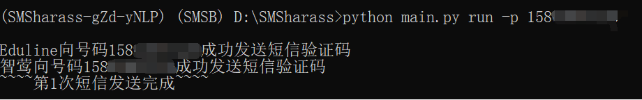
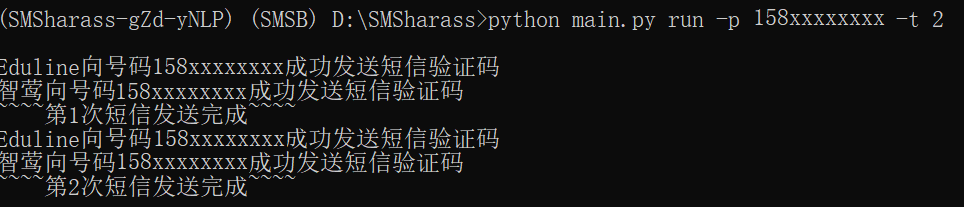

# demo-sms
a miniature of SMSBoom-master just for learning

[SMSBoom-master](https://github.com/OpenEthan/SMSBoom):可使用代理、支持多线程、可实现异步百万并发、支持多手机号的短信验证码轰炸程序

demo-sms:一个简单的短信验证码发送程序|记录[SMSBoom-master](https://github.com/OpenEthan/SMSBoom)项目学习成果

### 功能介绍
+ 功能一：提供一个手机号，该号码会立即收到两条短信验证码
   
+ 功能二：可设置发送短信次数，每次发送短信数目为2[^1]
   
[^1]:demo-sms程序仅提供两个短信接口
### 使用方法
1. 方法一：下载exe文件，运行exe程序
    + 在命令行窗口中进入exe文件所在目录
    + 输入exe文件名，运行程序
    + 执行功能一
    + 执行功能二
2. 方法二：配置虚拟环境后运行python程序
    + 安装pipenv
    + 命令窗口下进入项目所在目录，使用pipenv install命令配置虚拟环境
    + 使用pipenv shell命令激活虚拟环境
    + 运行python程序
    + 执行功能一
    + 执行功能二